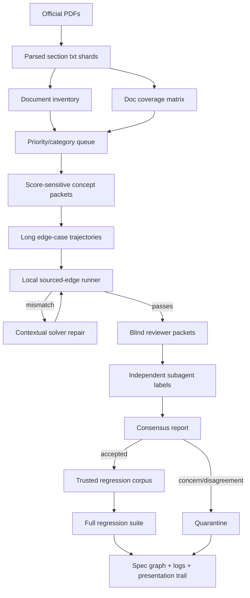
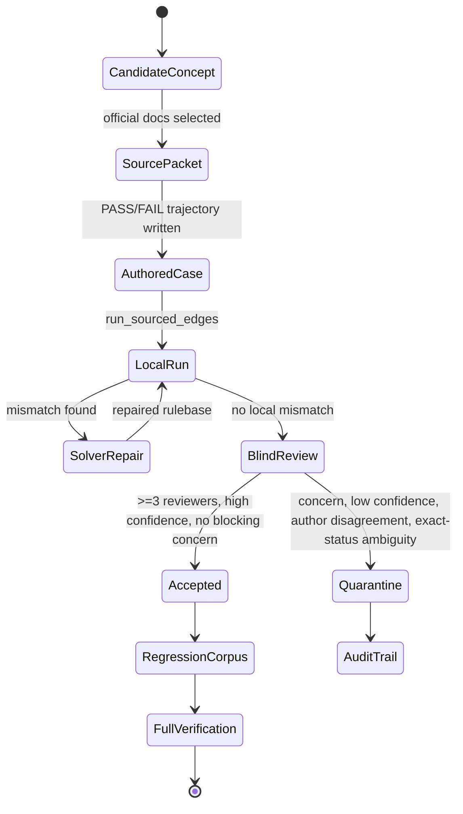
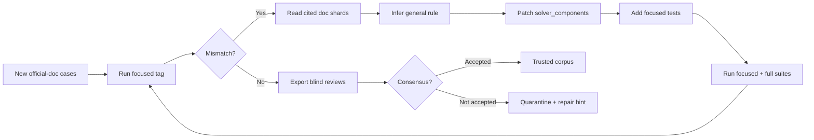
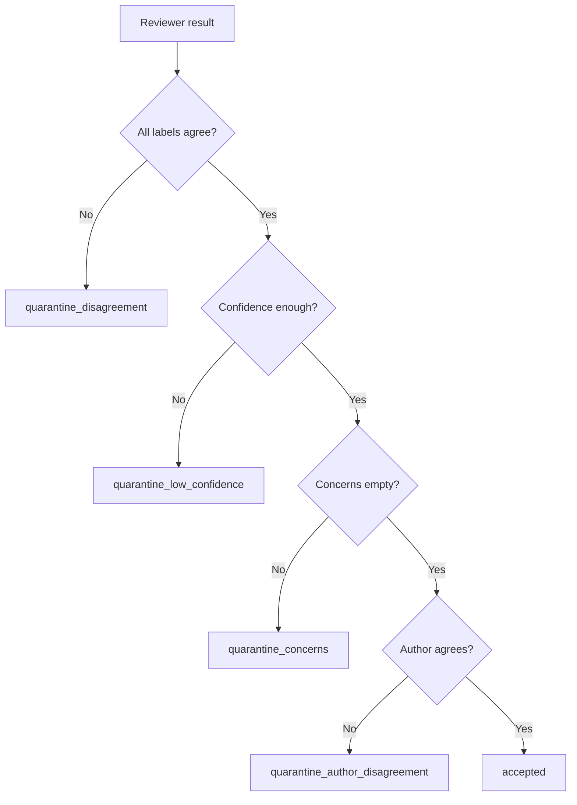
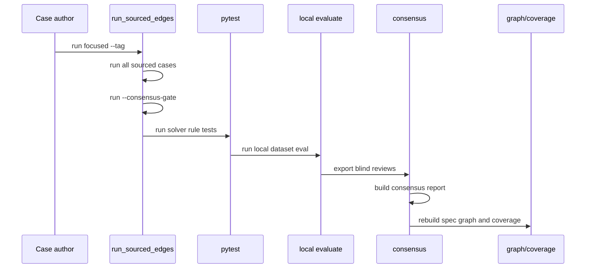
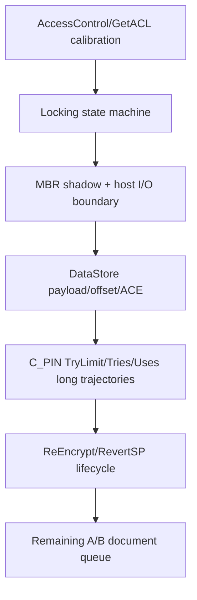

# TCG Storage API Rulebase Progress Visual Report

Generated: 2026-05-27 22:24 KST

Scope: 현재까지 공식 문서 기반 엣지 케이스를 어떻게 만들고, 검증하고, solver/rulebase에 반영했는지 발표용으로 추적 가능한 형태로 정리한다.

## 1. 한 줄 요약

현재 작업은 "공식 문서 section shard -> 개념/우선순위 인벤토리 -> 긴 상태 trajectory 엣지 케이스 -> 독립 reviewer 합의 -> accepted/quarantine 분리 -> solver repair -> 회귀 검증/로그"의 루프로 진행되고 있다.

## 2. 현재 스냅샷

| 항목 | 현재 값 | 의미 |
| --- | ---: | --- |
| 공식 문서 shard 총량 | 1376 | `artifacts/documents/core`, `artifacts/documents/opal`의 parsed txt section 수 |
| Core shard | 1208 | TCG Storage Architecture Core 쪽 section shard |
| Opal shard | 168 | TCG Storage Opal SSC 쪽 section shard |
| sourced case가 닿은 문서 | 478 | evidence로 연결된 section 수 |
| 아직 남은 A/B 우선순위 | 214 | 점수 영향 가능성이 큰 미커버/추가검토 후보 |
| sourced edge cases | 3056 | 공식 문서 evidence가 붙은 케이스 |
| accepted consensus cases | 2952 | 독립 reviewer 합의 후 trusted로 통과한 케이스 |
| quarantined cases | 104 | status/근거/해석 ambiguity 때문에 trusted set에서 제외된 케이스 |
| synthetic cases | 205 | 별도 synthetic regression set |
| unit tests | 910 passed | `tests/test_solver_rules.py` 기준 |
| local dataset eval | 100.00 | local `dataset/label.jsonl` 기준 |

진행률을 숫자로 보면:

```text
문서 coverage        478 / 1376  [##########....................] 34.7%
trusted consensus  2952 / 3056  [#############################.] 96.6%
A/B pending         214 docs    [remaining score-sensitive queue]
quarantine          104 cases   [kept out of trusted corpus]
```

주의: 문서 coverage 34.7%는 "전체 문서를 다 훑었다"가 아니라, 현재 trusted/sourced case가 evidence로 직접 연결한 section 기준이다. 실제 작업은 점수 영향이 큰 영역을 먼저 파는 score-first 방식이었다.

## 3. 문서를 훑은 방식

현재는 PDF를 매번 통째로 읽은 게 아니라, 이미 생성되어 있는 parsed txt shard를 기준으로 훑었다.

| 원천 | 위치 | 개수 | 현재 사용 방식 |
| --- | --- | ---: | --- |
| Core parsed text | `artifacts/documents/core/` | 1208 | section별 txt를 inventory/coverage/evidence source로 사용 |
| Opal parsed text | `artifacts/documents/opal/` | 168 | Opal preconfiguration, Locking SP, SSC-specific rows/keys 근거로 사용 |
| Materials PDF | `materials/Opal_Core_Spec.pdf` | 101 pages | macOS metadata title: `TCG Storage Security Subsystem Class (SSC): Opal` |
| Materials PDF | `materials/Opal_Family_Test_Case_Spec.pdf` | 94 pages | macOS metadata title: `TCG Storage Opal Family Test Cases Specification` |
| Materials PDF | `materials/project.pdf` | 10 pages | metadata title 없음 |

중요한 점:

- 현재 case 생성은 이미 있는 `*.txt` shard를 주 근거로 쓴다.
- `tools/build_doc_inventory.py`가 각 shard를 priority/category/pipeline state로 분류한다.
- 길고 표가 많은 section은 바로 다시 잘라 쓰기보다 `Sections recommended for subsharding: 98`로 표시해 두었다.
- `core/` parsed shard의 정확한 PDF 원본 매핑은 아직 별도 audit가 필요하다. 지금 report는 "현재 repo에 존재하는 parsed txt를 기준으로 작업했다"는 사실을 기준으로 한다.
- 즉, "이미 있는 section shard를 훑는 루프"는 돌아가고 있고, "대형 section 내부를 더 작은 concept shard로 재분할하는 루프"는 아직 별도 후속 최적화 영역이다.

## 4. 전체 파이프라인 시각화



## 5. 엣지 케이스 생명주기



## 6. Subagent / reviewer 합의 구조

합의 과정은 `tools/label_consensus.py` 기준으로 기록된다.

| 단계 | 하는 일 | 기록 위치 |
| --- | --- | --- |
| review export | 특정 case batch를 reviewer에게 blind packet으로 내보냄 | `analysis/label_reviews/` |
| label 작성 | reviewer가 PASS/FAIL, confidence, concerns를 기록 | `analysis/label_reviews/*.jsonl` |
| consensus build | author label을 독립 review로 세지 않고 집계 | `analysis/label_consensus_report.md` |
| accepted 승격 | 3명 이상, confidence 기준 충족, blocking concern 없음 | trusted consensus gate |
| quarantine 유지 | ambiguity, exact status 불확실, author/reviewer 불일치 | `quarantine_*` status |

현재 consensus policy:

| 정책 | 값 |
| --- | --- |
| minimum independent reviewers | 3 |
| minimum reviewer confidence | 0.75 |
| author label counted? | no |
| default export leakage 방지 | case name/author label hidden |

현재 quarantine breakdown:

| 상태 | 개수 | 의미 |
| --- | ---: | --- |
| `quarantine_concerns` | 78 | reviewer가 source/trajectory/status ambiguity를 표시 |
| `quarantine_disagreement` | 15 | reviewer 간 PASS/FAIL 불일치 |
| `quarantine_low_confidence` | 9 | confidence 기준 미달 |
| `quarantine_author_disagreement` | 2 | reviewer consensus와 author label 충돌 |

## 7. Solver repair 루프



수정 원칙은 case-specific hack이 아니라, 문서 문맥을 바탕으로 공통 상태/권한/row-existence 규칙을 고치는 것이다. 예를 들어 Range9만 막는 식이 아니라, `MaxRanges`와 observation history를 바탕으로 optional range support state를 계산하도록 일반화했다.

## 8. 실제 수정된 rulebase 영역

| 영역 | 파일 | 대표 수정 의미 |
| --- | --- | --- |
| expectation checking | `src/solver_components/expectations.py` | Get/Set/GetACL/Delete/host I/O 결과가 현재 상태와 맞는지 판정 |
| semantic predicates | `src/solver_components/semantics.py` | object existence, AccessControl association, optional range support 판단 |
| state transitions | `src/solver_components/transitions.py` | 성공한 method가 이후 상태에 미치는 영향 기록 |
| parsing/canonicalization | `src/solver_components/parsing.py` | symbolic name, UID, alias를 canonical object로 정규화 |

최근 핵심 repair는 다음과 같다.

| 시간 | repair | 점수 관련성 | 핵심 |
| --- | --- | --- | --- |
| 2026-05-27 10:49 | Read-only explicit host mutation nonpersistence | High | `Write=False` session의 host `Set` 결과를 persistent state에 반영하지 않음 |
| 2026-05-27 12:42 | Optional Locking Range GetACL existence guard | High | Range9+를 이름만 보고 존재한다고 보지 않음 |
| 2026-05-27 14:34 | LockingInfo MaxRanges observation consistency | Medium-High | Range9 관측 후 `MaxRanges=8` 반환을 모순으로 처리 |
| 2026-05-27 16:00 | Optional Range direct presence guard | High | direct `Get`/`Set`/`GenKey`/`CreateRow`도 optional support state 적용 |
| 2026-05-27 17:07 | Optional Range delete presence guard | Medium-High | `DeleteRow`/`Delete`도 Range9 optional absence 반영 |
| 2026-05-27 17:40 | Optional Range supported positive controls | Medium | `MaxRanges=9`이면 Range9 성공을 허용하는 positive control |
| 2026-05-27 20:46 | DataStore empty BooleanExpr + optional Range GetACL calibration | High | empty ACE expression false semantics, unobserved Range9 GetACL over-strictness 완화 |

## 9. 만들어진 케이스 축

최근 trusted/sourced corpus는 단순 단발 질문보다 상태가 누적되는 trajectory를 선호한다.

| 축 | 대표 tag | 검증한 개념 |
| --- | --- | --- |
| read-only session mutation | `readonly-explicit-nonpersistence-*` | `Write=False`에서 explicit host mutation이 영속화되지 않음 |
| AccessControl/GetACL | `getacl-optional-range-*`, `ace-kaes-*` | association existence, exact ACL refs, ACE/K_AES boundary |
| Locking optional ranges | `optional-range-*`, `lockinginfo-maxranges-*` | Range8/Range9, `MaxRanges`, direct object presence |
| DataStore authority behavior | `datastore-empty-booleanexpr-doc` | empty `BooleanExpr`, unauthorized byte-table Get/Set |
| C_PIN/Auth counters | `cpin-readonly-auth-tries-long-doc` | read-only session 안의 TPer-side `Tries`/`Uses` 변화 |
| MBR / host I/O | quarantined and accepted locking/MBR batches | MBR shadowing, read/write lock, boundary crossing |
| issued/preconfigured rows | read-only and exact cell batches | issued row read-only/preconfigured cell expectation |

## 10. Quarantine 처리 방식

quarantine은 "버린 케이스"가 아니라 "trusted regression에 넣기에는 아직 근거/상태/정확한 status가 애매한 케이스"다.



최근 quarantine 예시는 이런 성격이었다.

| 영역 | quarantine 이유 | 처리 |
| --- | --- | --- |
| MBR shadowing | MBR table payload/source가 trajectory에서 충분히 직접 관측되지 않음 | trusted 승격 보류, 더 direct한 관측 case 필요 |
| host I/O locking | 문서의 literal status와 solver status mapping 사이 ambiguity | exact status 고정 케이스는 보류 |
| ACE/DataStore | UID symbolic alias와 BooleanExpr 표현 차이를 reviewer가 우려 | evidence-tight 재작성 후 일부 통과 |
| unobserved Range9 GetACL absence | failure 자체는 가능하지만 exact failure status를 pin하기 어려움 | success/exact-ACL 쪽만 trusted, exact-status failure는 quarantine |

## 11. 기록/감사 산출물

| 파일/디렉터리 | 역할 |
| --- | --- |
| `analysis/solver_update_log.md` | 언제 어떤 케이스를 만들고 어떤 solver repair를 했는지 상세 로그 |
| `analysis/presentation_audit_trail.md` | 발표용 narrative와 감사 trail |
| `analysis/edge_case_backlog.md` | 앞으로 팔 concept/backlog |
| `analysis/label_consensus_report.md` | accepted/quarantine 현황과 reviewer별 판단 |
| `analysis/label_consensus_matrix.json` | consensus machine-readable matrix |
| `analysis/doc_inventory_summary.md` | 전체 1376 shard priority/category/pipeline summary |
| `analysis/doc_coverage_report.md` | 어떤 문서가 어떤 case evidence로 커버됐는지 |
| `analysis/doc_coverage_matrix.json` | coverage machine-readable matrix |
| `analysis/spec_graph/` | 문서 section, entity, rule, test link graph |
| `tools/run_sourced_edges.py` | sourced edge case 실행기 |
| `tools/run_synthetic_edges.py` | synthetic regression 실행기 |
| `tools/label_consensus.py` | blind review export/report |
| `tools/build_doc_inventory.py` | 문서 shard inventory 생성 |
| `tools/doc_coverage.py` | 문서 coverage 계산 |
| `tools/build_spec_graph.py` | 문서/entity/rule/test graph 생성 |

## 12. 검증 명령 흐름

현재 한 batch가 들어간 뒤의 표준 검증은 아래 순서다.



마지막으로 확인된 전체 검증 결과:

| 명령 | 결과 |
| --- | --- |
| `tools/run_sourced_edges.py` | 3056 cases, 0 mismatches |
| `tools/run_sourced_edges.py --consensus-gate` | 2952 accepted out of 3056, 0 mismatches |
| `tools/run_synthetic_edges.py` | 205 cases, 0 mismatches |
| `pytest tests/test_solver_rules.py` | 910 passed |
| `evaluate.py` with local dataset | score 100.00 |
| `tools/build_spec_graph.py` | 1376 sections, 3114 entities, 27 rules, 32021 edges, 3056 test links |
| `tools/doc_coverage.py` | 1376 docs, 3056 cases, 478 covered docs, 257 untriaged A/B |
| `tools/build_doc_inventory.py` | 1376 rows, 478 covered, 214 pending A/B, 416 pending low-priority, 268 non-normative |

## 13. 점수 우선 관점에서 지금까지의 판단

실제 private 정답을 보는 방식은 쓰지 않고, 점수 변화와 공식 문서 기반 repair를 함께 해석했다.

| 우선순위 | 영역 | 왜 중요한가 | 현재 상태 |
| ---: | --- | --- | --- |
| 1 | AccessControl/GetACL | 87.5 -> 87.0 하락 후보와 직접 연결 | optional Range9 over-strictness를 완화하고 exact ACL은 유지 |
| 2 | Locking state machine | RangeStart/Length, locks, LockOnReset, MBR, host I/O가 hidden trace에 잘 나올 수 있음 | optional range support state와 MaxRanges consistency 강화 |
| 3 | DataStore byte table | authority/ACE/payload overwrite가 상태 추적을 요구 | empty BooleanExpr 및 unauthorized Get/Set 보강 |
| 4 | C_PIN/Auth/TryLimit | long trajectory에서 `Tries`/`Uses`/session mode가 잘 꼬임 | read-only auth counter 케이스 통과 |
| 5 | issued/preconfigured rows | 77 -> 85 점프 후보 | read-only/preconfigured cell/readonly 계열 상당수 반영 |
| 6 | ReEncrypt/RevertSP/lifecycle | 점수 잠재력은 있으나 아직 집중도가 낮음 | A/B backlog에 남아 있음 |

## 14. 아직 남은 중요한 일

현재 방식으로 "최종 목표"인 모든 핵심 개념 조합 커버는 가능하지만, 두 가지를 분리해야 한다.

| 목표 | 현재 상태 | 다음 액션 |
| --- | --- | --- |
| 점수 올리기 | score-sensitive 영역 위주로 빠르게 개선 중 | AccessControl/GetACL, Locking/MBR, DataStore를 우선 계속 판다 |
| 문서 전체 completeness | 478/1376 section에 sourced case evidence 연결 | pending A/B 214부터 concept packet으로 계속 소화 |
| 대형 section 세분화 | 98개 subshard 후보만 표시됨 | 표 많은 section을 내부 concept shard로 재분할하면 누락 감소 |
| 발표 가능성 | 로그/consensus/coverage는 이미 축적됨 | 이 보고서와 audit trail을 묶어 story 구성 |
| quarantine 재처리 | 104개 보류 | exact status를 고정하지 않는 형태 또는 direct observation 형태로 재작성 |

## 15. 다음 루프 권장 순서

점수 우선이면 다음 순서가 가장 효율적이다.



구체적으로는:

| 순서 | 할 일 | 기대 효과 |
| ---: | --- | --- |
| 1 | GetACL ordinary/special method universe 재검토 | 87.5 -> 87.0 하락 후보 방어 |
| 2 | RangeNNNN/UserMMMM/K_AES exact ACL 적용 범위 재조정 | over-accept/over-reject 둘 다 줄임 |
| 3 | LockOnReset + reset 후 ReadLocked/WriteLocked 변화 | hidden state-machine 점수 가능성 |
| 4 | MBR active/inactive + mixed range host I/O | 지금 quarantine이 많은 애매 영역 정리 |
| 5 | DataStore offset/length/overwrite + personalized ACE | long trajectory 점수 가능성 |
| 6 | C_PIN TryLimit/Tries/Uses 긴 trajectory | session/auth counter 정교화 |

## 16. 발표용 핵심 스토리

발표에서는 아래 흐름이 가장 설득력 있다.

1. 공식 문서를 section shard로 쪼개고, 모든 section을 inventory/coverage 대상으로 만들었다.
2. 단순 테스트 생성이 아니라, 문서 개념을 조합해 상태가 누적되는 edge trajectory를 만들었다.
3. 각 case는 author label만 믿지 않고, 독립 reviewer 3명 이상의 blind consensus를 거쳤다.
4. 합의가 깨지거나 status가 애매하면 trusted corpus에 넣지 않고 quarantine으로 남겼다.
5. solver가 틀린 경우에는 그 case만 맞추지 않고, 문서 문맥에 맞는 일반 규칙으로 repair했다.
6. 모든 repair는 sourced cases, consensus-gate, synthetic tests, pytest, local eval, spec graph, coverage report로 다시 검증했다.
7. 그 결과 trusted corpus와 rulebase가 같이 성장하는 feedback loop가 만들어졌다.

## 17. 현재 결론

지금까지의 진행은 의도한 구조와 대체로 맞다. 특히 "엣지 케이스가 어떤 문서/개념에서 나왔고, solver의 어느 영역을 고치게 했는지"는 `solver_update_log`, consensus report, coverage matrix, spec graph에 남고 있다.

다만 아직 완전한 의미의 exhaustive document sweep은 아니다. 현재는 점수에 가장 영향이 커 보이는 AccessControl/GetACL, Locking optional range, DataStore, read-only mutation, C_PIN/Auth 쪽을 먼저 파는 중이며, 남은 A/B 214개와 대형 section 98개의 subsharding이 다음 completeness 병목이다.
